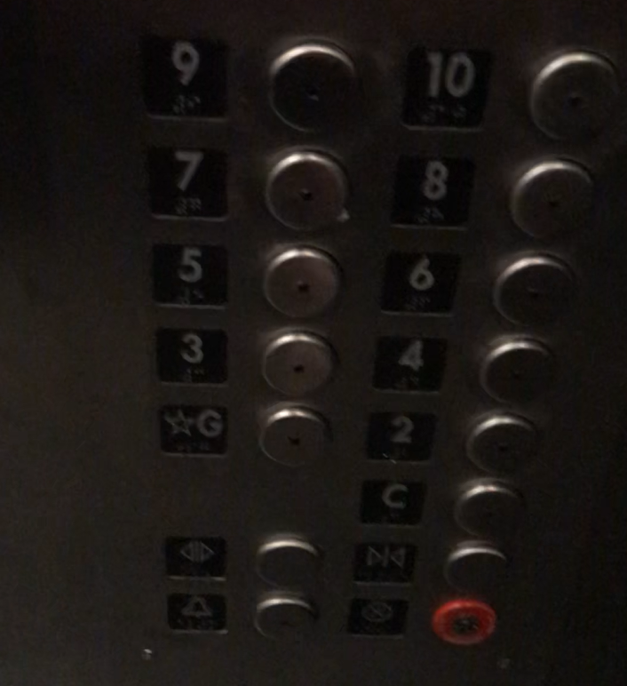
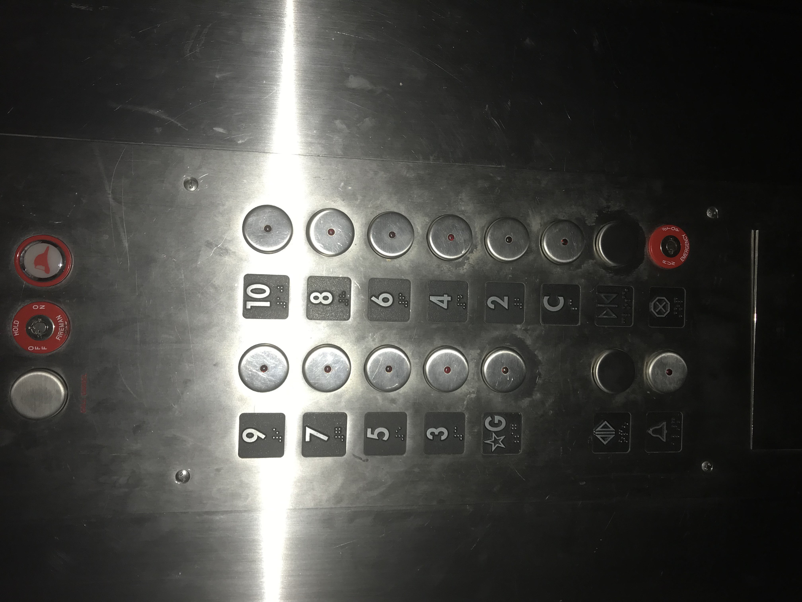
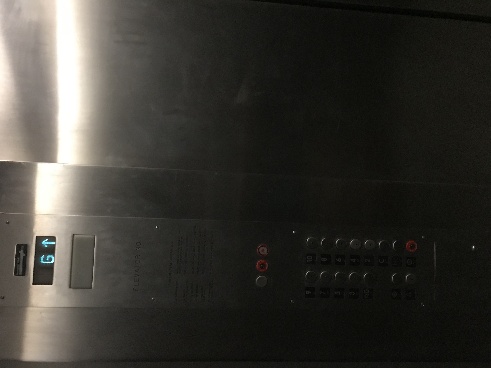
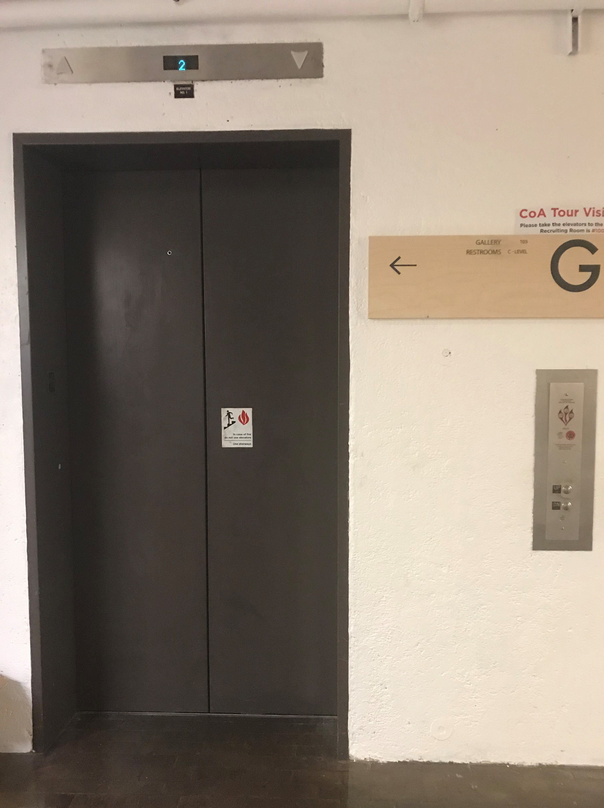
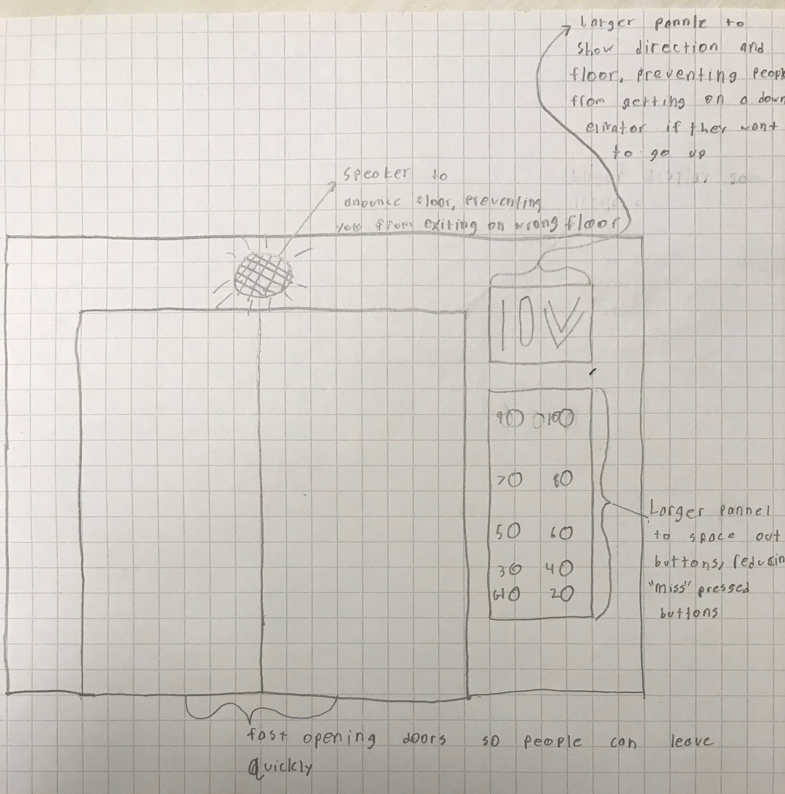

# Homework-1-The-Elevator-interface

## getting C:
### Find an elevator in the apartment/campus/hotel: 
elevator in TTU architecture building 

### Take photos of the control interface

 

### Show a gif image of the control interface in operation:

### Find the issues with the current design:
- If you press the wrong button on the elevator you cannot undress that button

### Explain why it is bad:
- The issue is bad because it forces you to stop at a floor you don't want to if you make a mistake.

## getting B:

### Think about the common things that you use an elevator. List your most common uses and other more rare uses. Does the interface make doing those common things easier?
- Common uses of an elevator are changing floors, and opening/closing elevator door. more rare uses are calling for help and setting the alarm off.
The example interface makes it more difficult to get to the correct floor.

### Think about how the user interacts with the elevator. What is the common sequence of actions?
- The common interaction with an elevator is; a user enters the elevator, selects a floor, waits for the elevator to get to the right
floor, let the doors open, exit the elevator.

### How does the elevator support the user figure out how to make it work?
- cultural norms, most elevators have the same format. Buttons light up to indicate which floor

### How does the elevator provide feedback to the user?
- The elevator tells the user what floor they are on, if they are going up or down, and what floors it will stop at

### What are some common mistakes you can make with this current design?
- Some common mistakes you can make with the design are hitting the wrong button, trying to go down when the elevator is goin up, and getting off on the wrong floor.

### Suggest the improvements to make on the control interface. Sketch your solution. And justify your design decisions

## Getting A:
[Touch screen interface](https://github.com/BenFischer001/Homework-1-The-Elevator-interface/blob/master/touchelv.pptx?raw=true)

